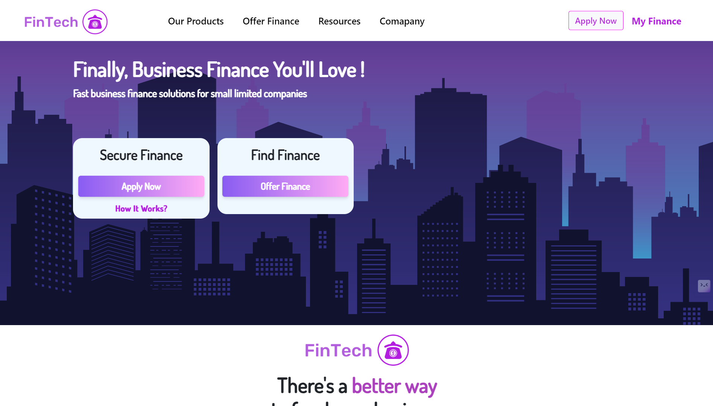
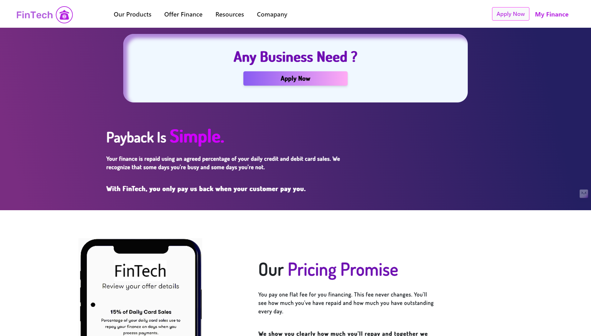
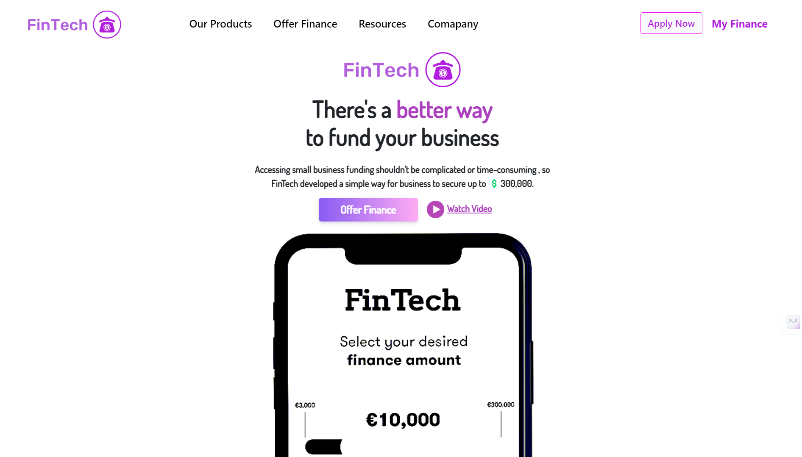

# 🌟 FinTech Business Landing Page 🌟

Welcome to the **FinTech Business Landing Page** repository! This project showcases a modern, responsive, and professional landing page designed for FinTech businesses, helping them make a bold digital statement. 💼💻

**Live Site:** [FinTech Business](https://fintechbusiness.vercel.app/) 🌐

---

## ✨ Features

- **🌐 Responsive Design**: Optimized for all screen sizes – from desktops to mobile devices.
- **💡 Modern UI**: Built with a clean and professional aesthetic using **TailwindCSS**.
- **⚡ Lightning Fast**: Powered by **Vite** for exceptional development and build performance.
- **🎨 Customizable**: Modular React components for easy expansion or adaptation.

---

## 🛠️ Tech Stack

- **Frontend Framework**: [React.js](https://reactjs.org/) – Building dynamic UIs.
- **CSS Framework**: [TailwindCSS](https://tailwindcss.com/) – For rapid and clean styling.
- **Bundler**: [Vite](https://vitejs.dev/) – Fast build and development environment.

---

## 🎯 Purpose

The aim of this project is to provide a visually appealing and responsive landing page template for financial technology businesses, streamlining their online presence. The repository is an excellent starting point for further customization and deployment of FinTech applications.

---

## 🖼️ Live Images

Here’s a glimpse of the **FinTech Business Landing Page**:





*Visit the [Live Site](https://fintechbusiness.vercel.app/) for a full experience!* 🌐

---

## 📂 Project Structure

```plaintext
fintech-business/
├── components/       # Reusable React components
├── node_modules/     # Project dependencies
├── public/           # Public assets
├── src/              # Source code
│   ├── App.jsx       # Main application file
│   ├── index.css     # Global styles
│   └── main.jsx      # Entry point
├── .eslintrc.cjs     # ESLint configuration
├── .gitignore        # Git ignored files
├── index.html        # Root HTML template
├── netlify.toml      # Netlify configuration
├── package-lock.json # Dependency lock file
├── package.json      # Project metadata and dependencies
├── README.md         # Project documentation
└── vite.config.js    # Vite configuration
```

---

## 🏃‍♂️ Getting Started

Follow the steps below to get the project running locally:

### Prerequisites

Make sure you have the following installed:

- [Node.js](https://nodejs.org/) (version 14+ recommended)
- npm (comes with Node.js)

### Installation

1. **Clone the Repository**  
   ```bash
   git clone https://github.com/your-username/fintech-business.git
   cd fintech-business
   ```

2. **Install Dependencies**  
   ```bash
   npm i
   ```

3. **Start the Development Server**  
   ```bash
   npm run dev
   ```

4. **Access the Application**  
   Open your browser and visit:  
   ```
   http://localhost:3000
   ```

---

## 🤝 Contribution

Contributions are always welcome! To contribute:

1. **Fork the Repository**.
2. **Create a New Branch**:  
   ```bash
   git checkout -b feature/your-feature
   ```
3. **Commit Your Changes**:  
   ```bash
   git commit -m "Added a new feature"
   ```
4. **Push to the Branch**:  
   ```bash
   git push origin feature/your-feature
   ```
5. **Submit a Pull Request**. 🎉

---

## 📬 Contact

If you have any questions or suggestions, feel free to reach out:

- **Email**: [kshitijsinghbisht777@gmail.com](mailto:kshitijsinghbisht777@gmail.com)
- **GitHub**: [Hailex798](https://github.com/hailex798)
- **LinkedIn**: [Kshitij Singh Bisht](https://linkedin.com/in/kshitijsinghbisht)
- **Portfolio**: [Kshitij Singh Bisht](https://kshitijsinghbisht.netlify.app)

---

## 🛡️ License

This project is licensed under the **MIT License**. Feel free to use and modify it for your own projects!

---

Made with ❤️ using **React.js**, **TailwindCSS**, and **Vite**.
``` 

Feel free to update the placeholder live images with actual screenshots! Let me know if you want additional tweaks. 😊